<small>*Euclid Instructing His Pupils in The School of Athens, Raffaello Sanzio da Urbino 1509-1511.*</small></br>

# 1. Elements of Networks

Although separated by 2000 years,
the discipline of programming practiced in Silicon Valley shares the same dream of
mathematics in Ancient Greece:
using *discrete* and *deterministic* descriptions to model reality.
Although mathematicians prove properties about mathematical objects with theorems
whereas programmers evaluate the values of said objects with programs,
what the two traditions share in common is the activity
of modeling *discrete objects* with *deterministic descriptions*
which in turn,
are created for them by toolsmiths referred to as logicians and interpreter/compiler implementors — the mathematician describes the world with a logic, and the programmer does so with a programming language.

For the programmer interested in learning the skills necessary for the
statistical learning approach to artificial intelligence, they must make a transition
to programming with *continous objects* $x$ using *stochastic functions* $f(x)$.
As always, history is a guide. And the transition in both *object* and *function*
has already been made by our mathematical cousins.
Although you will encounter many new concepts in your journey up ahead,
there are also many similarities with what you already know.
One simplistic way of viewing the art of programming is that
algorithms + data structures = programs, and that doesn't change
with the new world of "software 2.0".
So in [1.1 Continuously Stochastic *Data* $\mathbf{x}$ with `Python`](), we will first learn about programming *data* $\mathbf{x}$ of software 2.0
by representing types continuously with coordinates and
distributing truth stochastically with probability.
Then, in [1.2 Statistically Learning Stochastic *Functions* $y=f(\mathbf{x})$ with `numpy`](),
we will learn how to recover *stochastic functions* $y=f(\mathbf{x})$ of software 2.0
by defining stochastic maps with linear transformations.

**Contents**
- [1.1 Statistical Inference of Continuously Stochastic *Data* with `Python`]()
  - [1.1.1 Distributing Truth Stochastically with Probabilities of a Probability Space]()
  - [1.1.2 Probabilities on Equally Likely Events with Elementary Combinatorics]()
  - [1.1.3 Probabilities on Events with Rules: Sum Rule, Product Rule, Bayes Rule]()
  - [1.1.4 Random Variables with their Distributions, Expectations, and Variance]()
  - [1.1.5 Distributions and their Parameters from Data with Maximum Likelihood Estimation]()
- [1.2 Statistical Learning of Continuously Stochastic *Regressive Maps* with `numpy`](#12-statistical-learning-of-continuously-stochastic-maps-with-numpy)
  - [1.2.1 Representing Types in Higher Dimensions with the Coordinates of a Vector Space]()
  - [1.2.2 Linear Transformations with Matrix-Vector Multiplication]()
  - [1.2.3 The Simplest Inductive Bias: Linear Regression with Mean Squared Error Loss]()
  - [1.2.4 Fitting a Line Directly with Normal Equations]()
  - [1.2.5 Generalization, Bias-Variance Tradeoff, and Double Descent]()
- [1.3 Statistical Learning of Continuously Stochastic *Classifying Maps* with `numpy`]()
  - [1.3.1 Logistic Regression and Cross Entropy Loss]()
  - [1.3.2 Limitations of Direct Optimization]()
  - [1.3.3 Fitting a Line Iteratively with Derivatives of Hilbert Space in Gradient Descent]()
  - [1.3.4 Generalized Linear Models: Linear and Logistical Regression]()
- [1.4 Programming `teenygrad` *Level -1*: Tensor, the Multidimensional Array](#14-programming-teenygrad-level--1-high-dimensional-data-and-function)
  - [1.4.1 From Abstract Linear Algebra to Numerical Linear Algebra]()
  - [1.4.2 The Simplest `Tensor` Implementation with Nested `list`s]()
  - [1.4.3 Improving the Locality of `Tensor` by Decoupling Copies and Views with Strides]()
  - [1.4.4 Implementing Basic Linear Algebra Subroutines: `SAXPY`, `SGEMV` and `SGEMM`]()
- [1.5 Programming `teenygrad` *Level 0*: Accelerating the `BLAS` with `rustc` and `x86`](#15-programming-teenygrad-level-0-accelerated-basic-linear-algebra-subroutines)
  - [1.5.1 Computation and Communication with the von Neumann Architecture]()
  - [1.5.2 Bottlenecks with Rooflines, Benchmarks, and Profiles]()
  - [1.5.3 Accelerating `CPython` with Extension Modules via `PyO3` and `Rust`]()
  - [1.5.4 Accelerating `GEMM` on CPU from `Rust` to `x86` with `rustc`]()
  - [1.5.5 Accelerating `GEMM` on CPU with Locality of Memory Hierarchies]()
  - [1.5.6 Accelerating `GEMM` on CPU with Instruction Level Parallelism]()
  - [1.5.7 Accelerating `GEMM` on CPU with Data Level Parallelism]()
  - [1.5.8 Accelerating `GEMM` on CPU with Thread Level Parallelism]()
- [1.6 Programming `teenygrad` *Level 1*: Optimization and Differentiation](#16-programming-automatic-differentiation-and-gradient-descent)
  - [1.6.2 Symbolic, Numerical, and Automatic Differentiation]()
  - [1.6.3 Reverse Mode Automatic Differentiation with `Tensor.backward()`]()
  - [1.6.4 Iterative Optimization with `optim.sgd`]()
  - [1.6.5 Iterative Optimization with `optim.adam`]()

## 1.1 Statistical Inference of *Stochastic Data* with `Python`

### 1.1.1 Distributing Truth Stochastically with Probability Spaces
Throughout the history of mathematics, it was uncertain whether
probabilities could be modeled with existing mathemtical formalisms,
because by default, mathematical reasoning was understood to be *deterministic*
where some proposition $A$ was judged to be either true or false,
rather than some stochastic *experiment* with many possible states.
It wasn't until 1933 where Kolmogorov formalized *probability theory*[^1] with the following set-theoretic construction:
1. the set of all possible states (*outcomes*) of the experiment is the *sample space* $\Omega$
2. the set of all possible *subsets* of the *sample space* is the *event space* $\mathcal{F} \subseteq \Omega$
3. a *measure* $\mathbb{P}:\mathcal{F}\to[0,1]$ which maps all events to some real between $0$ and $1$

```bob                      
   .---------------.
   |               |                      | 1
   |      ω₅  •    |                      |
   |  .-------.    |                      |
   |  |   B   |    |                      |
   |  | ω₄ •  |----|--------------------->| ℙ(B)
   |  | ω₃ •  |    |                      |
   |  '-------'    |   Probability Law    |
   |               |   ℙ:  2^Ω -> [0,1]   |
   |  .-------.    |                      |
   |  |   A   |    |                      |
   |  | ω₂ •  |----|--------------------->| ℙ(A)
   |  | ω₁ •  |    |                      |
   |  '-------'    |                      |
   |               |                      |
   '---------------'                      | 0
    Sample Space Ω
    Event Space  2^Ω

    Figure n
```
<u>Two Interpretations</u></br>
Together this triplet of two sets and one function $(\Omega, \mathcal{F}, \mathbb{P})$ defines a *probability space*.
Focusing on the map $\mathbb{P}$, although it formalizes the notions of "chance", "likeliness", and "probability"
as a numerical assignment between $0$ and $1$ on every event in the event space,
there are two possible semantic interpretations of the value *returned* by this function when modeling real-world stochastic phenomena
— namely that of the so-called *frequentist* and *bayesian* interpretation of probability.
The former interprets probabilities (the values returned by the probability measure)
as an "objective" *belief* where the value returned is the *count* of the event in which an infinite sequence of repeated trials converges to.
That is,
$$\mathbb{P}(E) = \lim\limits_{n\to\infty} \frac{\text{count}(E)}{n}$$

so for instance, the most trivial example is an experiment of rolling a single fair coin
with a probability assignment of $\mathbb{P}(\{\text{head}\})=0.5$.
The experiment can be repeated many times,
and the frequency between the count of heads and the number of trials will converge to $0.5$.
As programmers, running a simulation of such experiment is quite simple:

```python
import random

sample_space = {"🐶", "🐕"} # dog head, dog tail
def experiment():
  outcome = random.choice(list(sample_space))
  return outcome

if __name__ == "__main__":
  n = 10_000_000
  target_e, target_e_count = {"🐶"}, 0
  for i in range(n):
    outcome = experiment()
    if outcome in target_e: target_e_count += 1

  prob_e = len(target_e) / len(sample_space)
  freq_e = target_e_count / n
  print(f"the expected probability of {target_e} is {prob_e}")
  print(f"the actual frequency of {target_e} in {n} trials is {freq_e}")
```

Although running the simulation results in slightly different numbers,
they are all close to $0.5$ within a few precision points.
The probability assignment of $0.5$ is something that can be "objectively" verified.
To contrast, bayesian interpretation of probabilities are "subjective" beliefs
where the value returned represents the internal uncertainty of the observer.
For instance, consider an unfair die (todo..)


It's important to remember that neither interpretation is "the" correct one,
and often times the *availability of data* implies which one to use.
todo..returning to functional axiomaticization...probability is the weight of a set.

Either way, all probabilities are formally modeled by the two sets and one function of
$(\Omega, \mathcal{F}, \mathbb{P})$, with $\mathcal{F} \subseteq \Omega$ and $\mathbb{P}: \mathcal{F}\to[0,1]$
which additionally, must satisfy three axiomatic invariants[^2]:
- **non-negativity:** $\forall E \in \mathcal{F}, \mathbb{P}(E) \geq 0.$
- **normalization:** $\sum\limits_{i=0}^{\infty} \mathbb{P}(E_i)=1.$
- **additivity:**

For instance, thus far we've seen a discrete sample space,
and we'll encounter continuous ones such as $\reals$ and $\reals^n$
starting with chapter [1.1.4 Representing Types Continuously with Vector Spaces]().
But for now, the next two chapters of
[1.1.2 Probabilities on Equally Likely Events with Elementary Combinatorics]()
and [1.1.3 Probabilities on Events with Rules: Sum Rule, Product Rule, Bayes Rule]()
present different experiments to reify the abstract concept of *probability space*,
starting with those that admit themselves to *equally likely* finite sample spaces,
where $\forall o_i \in \Omega, \mathbb{P}(\{o_i\}) = \frac{1}{\vert\Omega\vert}$,
which subsequently allows the probability measure $\mathbb{P}$ to be that of a *counter*,
reducing the calculation to that of *enumerating*, *counting* the two sets of sample space and event,
and then evaluating the *ratio*:
i.e $\mathbb{P}(E)=\frac{\vert E \vert}{\vert \Omega \vert}$, which
— demonstrating with the earlier coin flip example —
is evaluated with `len` and `/` on Python's [`set`](https://docs.python.org/3/library/stdtypes.html#types-set):
```python
sample_space, target_e = {"🐶", "🐕"}, {"🐶"}
prob_e = len(target_e) / len(sample_space)
print(f"the probability of {target_e} is {prob_e}")
```

### 1.1.2 Probabilities on Equally Likely Events with Elementary Combinatorics
<u>Example 1</u></br>
*Consider the sum of rolling two dice.*</br>
*What is the probability that the sum is 8?*</br>

<details>
  <summary>Solution 1: ⚠️ STOP and THINK, then click to reveal.</summary>
</details>

```python
sample_space = {"1️⃣", "2️⃣", "3️⃣", "4️⃣", "5️⃣", "6️⃣"} # six-sided die
event = {"2️⃣", "4️⃣", "6️⃣"}
prob_event = len(event) / len(sample_space)
print(f"the probability of {event} is {prob_event}")
```


<u>Example 2</u></br>
*Consider a jar with four red balls and two blue balls.*</br>
*What is the probability of choosing 1 red ball and 2 blue balls?*</br>

<details>
  <summary>Solution 2: ⚠️ STOP and THINK, then click to reveal.</summary>

This is the hidden spoiler content. 
It can contain more Markdown, like **bold text**, lists, or [links]()

```python
import itertools

# get all 4! = 24 permutations of 1,2,3,4 as a list:
print(list(itertools.permutations([1,2,3,4])))
# [(1, 2, 3, 4), (1, 2, 4, 3), (1, 3, 2, 4), (1, 3, 4, 2), (1, 4, 2, 3), (1, 4, 3, 2), (2, 1, 3, 4), (2, 1, 4, 3), (2, 3, 1, 4), (2, 3, 4, 1), (2, 4, 1, 3), (2, 4, 3, 1), (3, 1, 2, 4), (3, 1, 4, 2), (3, 2, 1, 4), (3, 2, 4, 1), (3, 4, 1, 2), (3, 4, 2, 1), (4, 1, 2, 3), (4, 1, 3, 2), (4, 2, 1, 3), (4, 2, 3, 1), (4, 3, 1, 2), (4, 3, 2, 1)]

# get all 3!/2! = 3 unique permutations of 1,1,2 as a set:
print(set(itertools.permutations([1,1,2])))
# {(1, 1, 2), (1, 2, 1), (2, 1, 1)}
```

```python
import itertools
# Get all ways of choosing three numbers from [1,2,3,4,5]
print(list(itertools.combinations([1,2,3,4,5], 3)))
# [(1, 2, 3), (1, 2, 4), (1, 2, 5), (1, 3, 4), (1, 3, 5), (1, 4, 5), (2, 3, 4), (2, 3, 5), (2, 4, 5), (3, 4, 5)]
```

</details>

<u>Example 3</u></br>
*Consider a deck of cards with 52 cards with 13 ranks and four suits.*</br>
*What is the probability of choosing a straight (five consecutive cards)*?</br>

<details>
  <summary>Solution 3: ⚠️ STOP and THINK, then click to reveal.</summary>
</details>

Because the previous examples admitted equally likely outcome spaces, the calculation of probability was reduced to that of *counting*,
which can be done via Python's builtin support for elementary combinatorics via iterators such as [`itertools.permutations`](https://docs.python.org/3/library/itertools.html#itertools.permutations)
and [`itertools.combinations`](https://docs.python.org/3/library/itertools.html#itertools.combinations).
If these builtins were not provided, the set of all permutations or combinations can be generated with *backtracking*,
— an exhaustive search (searching through the entire state space) technique that can implemented with either recursion or iteration:

```python
from typing import TypeVar, Generic
T = TypeVar('T')

def permutations(input: list[T]) -> list[list[T]]:
  return []

def combinations(input: list[T]) -> list[list[T]]:
  return []
```

If you are new to *programming*,
please refer to [HTDP Part 2: Arbitrarily Large Data](https://htdp.org/2019-02-24/part_two.html),
[DCIC Chapter 5: Lists](https://dcic-world.org/2025-08-27/part_lists.html),
and [DCIC Chapter 9: From Pyret to Python]().
If you are new to *python*, please refer to the [Python Tutorial](https://docs.python.org/3/tutorial/index.html).

### 1.1.3 Probabilities on Events with Rules: Sum Rule, Product Rule, Bayes Rule

sum rule (or, mutually exclusive), product rule (and, independance)
(footnote: sum rule, product rule with derivatives. sum types and product types with algebraic data types)

*Bayes Rule*
(Conditional probability) -> logic is a corner case

different sample spaces...
distributions


### 1.1.4 Random Variables with their Distributions, Expectations, and Variance
<iframe width="698" height="393" loading="lazy" src="https://www.youtube.com/embed/cy8r7WSuT1I?si=KHSJ5xM_fu91vkKu" title="YouTube video player" frameborder="0" allow="accelerometer; autoplay; clipboard-write; encrypted-media; gyroscope; picture-in-picture; web-share" referrerpolicy="strict-origin-when-cross-origin" allowfullscreen></iframe>

*Bernouilli*

*Gaussian*
$$
\begin{aligned}
X &\sim \mathcal{N(\mu, \sigma)} \\
            &= 
\end{aligned}
$$

then evaluate middle $E[X]=\mu$, width $Var(X)=\sigma$
standard normla (0,1)

f(x) = cexp(x^2 / 2)


mean mu, covariance sigma
```python
import math, dataclasses

@dataclasses.dataclass
class Gaussian:
  mu: list[float]
  sigma: list[list[float]]

  def pdf(self, x:) -> float:
    return math.exp()

```

*Exponential*

### 1.1.5 Probabilities from Data with Parameter Estimation


## 1.2 Statistical Learning of *Continuously Stochastic Maps* with `numpy`
After completing [1.1 Statistical Inference of *Stochastic Data* with `Python`](),
you now understand the core essence behind the
*statistical learning* approach to *artificial intelligence*
which is
1. the generative-like nature of *evaluating* a stochastic function
2. the recovery-like nature of *inverting* such a function

```bob

                      "sampling"/"generating" X's
                    .----------------------.
                   /                        \
                  /                          v
      .-----------.                          .-----------.
      |           |                          |           |
      |           |                          |           |
      |           |                          |           |
      |           |                          |           |
      |  Params θ |                          | Samples X |
      |           |                          |           |
      |           |                          |           |
      |           |                          |           |
      |           |                          |           |
      '-----------'                          '-----------'
                  ^                          /
                   \                        /
                    '----------------------'
                    "inferring"/"estimating" θ's

      Figure n
```


and stands in contrast to the classic way of programming which is to
specify and declare functions *up front* with explicit deterministic instructions.
The software 2.0 essence of *recovering functions from data* is more appropriate
for continuously stochastic phenomena such as language and vision.
Now, in [1.1 Statistical Inference of *Stochastic Data* with `Python`](),
we move on to not just recovering data $X \sim p$, but *maps* $Y=X \sim p$
in coordinate systems with higher dimensions.

### 1.2.1 Representing Types in Higher Dimensions with the Coordinates of a Vector Space
Probability space $(\Omega, \mathcal{F}, \mathbb{P})$, we want to "plug in" a
set of outcomes in higher dimensions..


In the traditional way of programming software 1.0, data is *discrete*.
You may have experience using (and in a data structure class, implementing)
collections such as sets, associations, sequences, trees, and graphs.
Although many of us have graduated onto these more "complex" data structures,
representing types discretely becomes problematic when it comes to modelling
*fuzzy-spectrum-like* phenomena such as *language* and *vision*.
The continous alternative to the discrete descriptions thus far is a notion
that everyone was introduced to in middle school: a *coordinate system*,
and there happens to be an "escape hatch" which all programming languages provide —
simply representing a type with numerical `float` fields only.
Try executing the code below:

```python
from dataclasses import dataclass

@dataclass
class PhysicalCoord:
  x: float # length
  y: float # width
  z: float # height

  def __repr__(self) -> str:
    return f"({self.x}, {self.y}, {self.z})"

if __name__ == "__main__":
  fly1 = PhysicalCoord(x=3.0, y=4.0, z=5.0)
  fly2 = PhysicalCoord(x=9.0, y=10.0, z=11.0)
  print(f"physical position of fly 1 🪰 is {fly1}")
  print(f"physical position of fly 2 🪰 is {fly2}")
```

Although the example is trivial, it illustrates the *essence* in representing data *continuously*.
Rather than discretely enumerate through all possible positions of a plane,
the type is compressed and uniquely described by three fields of `x`, `y` and `z`
so that any position on a plane
— or at least up until the maximum value that Python's floating point numbers support —
can be described by three numbers.

The three fields with floating point values which the `PhysicalCoord3D` type consists of
can be used to model phenomena too besides that of physical space.
For instance, consider modeling houses, where each house object is a coordinate in some logical space of homes.
This is done by replacing the three earlier fields of `length`, `width` and `height`
that that of `size`, `age`, and `rooms`:

```python
from dataclasses import dataclass

@dataclass
class HouseCoord:
  size:  float # ft^2
  age:   float # yrs
  rooms: float # count

  def __repr__(self) -> str:
    return f"({self.size}, {self.age}, {self.rooms})"

if __name__ == "__main__":
  house1 = HouseCoord(size=3.0, age=4.0, rooms=5.0)
  house2 = HouseCoord(size=9.0, age=10.0, rooms=11.0)
  print(f"logical position of house 1 is {house1}")
  print(f"logical position of house 2 is {house2}")
```

And keep in mind that `HouseCoord3D` is not a coordinate in physical space,
but rather one in a logical space.
Moving on, there's nothing stopping us from increasing the expressivity of the house type
adding fourth field whose value is the number of floors.

```python
from dataclasses import dataclass

@dataclass
class HouseCoord:
  size:   float # ft^2
  age:    float # yrs
  rooms:  float # count
  floors: float # count

  def __repr__(self) -> str:
    return f"({self.size}, {self.age}, {self.rooms}, {self.floors})"

if __name__ == "__main__":
  house1 = HouseCoord(size=3.0, age=4.0, rooms=5.0, floors=2.0)
  house2 = HouseCoord(size=9.0, age=10.0, rooms=11.0, floors=3.0)
  print(f"logical position of house 1 is {house1}")
  print(f"logical position of house 2 is {house2}")
```

and so on, up until some arbitary $n$ number of fields.
Taking a step back, what `PhysicalCoord`, `HouseCoord`
share in common is that they are *lists of numbers*, indexed by interpretable fields.
To generalize and abstract these escape hatches that allow us to represent types continuously,
we can define a generic `Coord4Fields` dataclass with fields labeled as `xi` for `0<=i<=4`,
and push the responsibility of keeping track of which field (dimension) corresponds to which attribute to the caller.

```python
from dataclasses import dataclass

@dataclass
class Coord4Fields:
  x0: float
  x1: float
  x2: float
  x3: float

  def __repr__(self) -> str:
    return f"({self.x0}, {self.x1}, {self.x2}, {self.x3})"

if __name__ == "__main__":
  house1 = Coord4Fields(x0=3.0, x1=4.0, x2=5.0, x3=2.0)
  house2 = Coord4Fields(x0=9.0, x1=10.0, x2=11.0, x3=3.0)
  print(f"logical position of house 1 is {house1}")
  print(f"logical position of house 2 is {house2}")
```

```bob


  0D            1D              2D                3D                      4D
 Point         Line           Square             Cube                 Tesseract

                                +-----+        +-------+             +-------+
                                |     |       /|      /|            /|+-----+|
                                |     |      / |     / |           / ||     ||
   *          *----*            |     |     +-------+  |          +-------+  |
                                |     |     |  +----|--+          |  |+-----|+
                                |     |     | /     | /           | /| |   /||
                                +-----+     |/      |/            |/ +-|---+ |
                                            +-------+             +---|---+| |
                                                                  |   +---|-|-+
                                                                  |  /|   | |/
                                                                  | / |   | +
                                                                  |/  |   |/
                                                                  +-------+

  Figure n
```
If we want a general data structure that works for any number of fields $n$,
we can simply reuse Python's builtin `list[]`, limiting it's elements to floating point numbers with `list[float]`.
When representing types continuously, these lists of numbers are referred to as **vectors**,
which is more precisely defined as a mapping from some $n\in\Z$ to $\reals$,
denoted by $\reals^n$, which is exactly the functionality that a `list[]` provides:

define notions of dependance, basis, and dimension copmutationally..

```python
if __name__ == "__main__":
  house1 = [3.0, 4.0, 5.0, 2.0]
  print(f"logical position of house 1 is ({house1[0]}, {house1[1]}, {house1[2]}, {house1[3]})")
```

With the generality of the `list[float]` data structure,
we can continue to add an arbitrary number of elements which capture other aspects to what makes a home a home.
But now consider writing a program that can *update* and *change* homes with renovations.
i.e given a house, perform a renovation that increases the square feet by 10.0,
no change to the age, two more rooms, and another floor.
Perhaps adding the two lists will evaluate the intended result?
```python
if __name__ == "__main__":
  house1 = [3.0, 4.0, 5.0, 2.0]
  renovation = [10.0, 0.0, 2.0, 1]
  house1_renovated = house1 + renovation
  print(f"logical position of house1 renovated {house1_renovated}")
```

The `+` operation defined on `list[]` is clearly non-sensible for our use case.

```python
if __name__ == "__main__":
  house1 = [3.0, 4.0, 5.0, 2.0]
  house1 = [3.0, 4.0, 5.0, 2.0]
  house1_renovated = house1 + house1
  print(f"house1 renovated {house1_renovated}")
```

produces another one that's  twice as big, 

develop a *linear arithmetic and algebra* for these lists of numbers x+y and a*x
why linear?

```python
if __name__ == "__main__":
  house1 = [3.0, 4.0, 5.0, 2.0]
  house2 = [9.0, 10.0, 11.0, 3.0]
  house3 = house1 + house2
  house4 = house1 * 3
  print(house3)
  print(house4)
  # print(f"position of house 1 is {house1[0]}, {house1[1]}, {house1[2]}, {house1[3]}")
```

computational perspective..list of numbers
<iframe width="698" height="393" loading="lazy" src="https://www.youtube.com/embed/fNk_zzaMoSs?si=RM4DkmjjxivKNjN7" title="YouTube video player" frameborder="0" allow="accelerometer; autoplay; clipboard-write; encrypted-media; gyroscope; picture-in-picture; web-share" referrerpolicy="strict-origin-when-cross-origin" allowfullscreen></iframe>

what is the mathematical perspective?

<iframe width="698" height="393" loading="lazy" src="https://www.youtube.com/embed/TgKwz5Ikpc8?si=IA44m9h0QALa-YKR" title="YouTube video player" frameborder="0" allow="accelerometer; autoplay; clipboard-write; encrypted-media; gyroscope; picture-in-picture; web-share" referrerpolicy="strict-origin-when-cross-origin" allowfullscreen></iframe>

<iframe width="698" height="393" loading="lazy" src="https://www.youtube.com/embed/k7RM-ot2NWY?si=GK0BOgsmchUV52Mx" title="YouTube video player" frameborder="0" allow="accelerometer; autoplay; clipboard-write; encrypted-media; gyroscope; picture-in-picture; web-share" referrerpolicy="strict-origin-when-cross-origin" allowfullscreen></iframe>

### 1.2.2 Linear Transformations with Matrix-Vector Multiplication
<iframe width="698" height="393" loading="lazy" src="https://www.youtube.com/embed/kYB8IZa5AuE?si=GPQlzJ1uEg83PX8o" title="YouTube video player" frameborder="0" allow="accelerometer; autoplay; clipboard-write; encrypted-media; gyroscope; picture-in-picture; web-share" referrerpolicy="strict-origin-when-cross-origin" allowfullscreen></iframe>


### 1.2.3 The Simplest Inductive Bias: Linear Regression
The primary goal of the statistical learning approach to artificial intelligence
is *induction*, which is to use data in order to make accurate predictions in new situations
with some function $f: \mathcal{X} \to \mathcal{Y}$.
When there's access to historical data of the expected output $y$ for some input $x$, we refer
to this regime as *supervised learning*, for the learning algorithm is being "supervised" with the right answer.

In particular, the dataset is split into a *training set* $d_{\text{train}}= \{(x^{(i)},y^{(i)})\}_{i=0}^n$,
and a *testing set* $d_{\text{test}}= \{(x^{(i)},y^{(i)})\}_{i=0}^{n^*}$.
Once the function $f$ is recovered from the training set, it's ability to generalize is evaluated on the test set.
that is, predict a value $y^{(n+1)}$ given some unseen observation $x^{(n+1)}$.
Machine learning has its roots in statistical inference, and so we also refer to
the data as observations or evidence, and the function as hypotheses or models.

For instance, consider the task of *house price prediction*[^5] where the collected [dataset](https://www.cs.toronto.edu/~delve/data/boston/bostonDetail.html)
$d= \{(x^{(i)},y^{(i)})\}_{i=0}^n$ are input-output pairs of square feet, and dollars, respectively.
Let's take a look at this data.

```python
import matplotlib.pyplot as plt
X, Y = [1500, 2100, 800], [500000, 800000, 250000]
plt.scatter(X,Y)
plt.title("Price vs Size")
plt.xlabel('ft^2')
plt.ylabel('$')
plt.show()
```

<div id="pyodide-plot"></div>
<script src="https://cdn.jsdelivr.net/pyodide/v0.25.1/full/pyodide.js"></script>
<script>
(async () => {
  const pyodide = await loadPyodide({ indexURL: "https://cdn.jsdelivr.net/pyodide/v0.25.1/full/" });
  await pyodide.loadPackage("micropip");
  const micropip = pyodide.pyimport("micropip");
  await micropip.install("matplotlib");
  await pyodide.runPythonAsync(`
import io, base64
import matplotlib.pyplot as plt
from js import document
fig, ax = plt.subplots(figsize=(3, 2.25))
X, Y = [1500, 2100, 800], [500000, 800000, 250000]
plt.scatter(X,Y)
plt.title("Price vs Size")
plt.xlabel('ft^2')
plt.ylabel('$')
buf = io.BytesIO()
fig.savefig(buf, format="png", dpi=100, bbox_inches="tight")
buf.seek(0)
img = document.createElement("img")
img.src = "data:image/png;base64," + base64.b64encode(buf.read()).decode("ascii")
document.getElementById("pyodide-plot").appendChild(img)
plt.close(fig)
`);
})();
</script>

In the case of house price prediction,
the input space $\mathcal{X}=\reals$ is the size in square feet, and the output space $\mathcal{Y}=\reals$ is the price,
which means the function to recover has type $f:\reals \to \reals$.
Since enumerating through every house size and price pair in $\reals$ is intractable
(otherwise all pairs could be inserted inside a lookup), an assumption
about the structure of the data *needs* to be made, referred to as the
*inductive bias*.
The simplest assumption to make is to *assume* that there exists a linear relationship
between the data so that $f$ is determined by two parameters of slope $m$ and intercept $b$. That is,
$$
\begin{aligned}
f &:\reals \to \reals\\
f(x;m,b) &\coloneqq \underbrace{m}_{\text{parameter}}x+\underbrace{b}_{\text{parameter}}
\end{aligned}
$$

where $f(;)$ is used to denote the differentiation between input and parameter[^6].
Implementing computable $f$ looks like the following,
where each evaluation of `fhat()` passes in a random number for the slope parameter of `x`.
Feel free to modify the range for $m$ and run the code a few times to see the different values `fhat()` produces as predictions.

```python
def fhat(x: float, m: float, b: float) -> float:
  yhat = x*m+b
  return yhat

if __name__ == "__main__":
  import random
  X, Y = [1500, 2100, 800], [500000, 800000, 250000]
  m, b = random.uniform(-3.0, 3.0), random.uniform(-3.0, 3.0)

  for (xi,yi) in zip(X,Y):
    yihat = fhat(xi,m,b)
    print(f"expected: ${yi}, actual: ${yihat:.2f}")
```

And instead of evaluating `fhat()` for each input `xi` sequentially in a loop,
we can change the type of the input from a *scalar* $x \in \reals$ to a *vector* $X \in \reals^n$
so that the predictions can be evaluated in a single vector-scalar multiplication
(and subsequently vector-scalar addition) where
$$
\begin{aligned}
f_{\text{batched}} &:\reals^n \to \reals^n\\
f_{\text{batched}}(\mathbf{x};m,b) &\coloneqq m\mathbf{x}+b
\end{aligned}
$$

Some languages are adding support for multidimensional arrays in their standard libraries (todo, footenote with cpp),
but all numerical computing in python which involve the evaluation of
high dimensional functions are conducted in the `numpy` package which provides the `numpy.ndarray` data structure
and operations *accelerated* by vector instructions in hardware.

```python
import numpy as np

def fhatbatched(X_n: np.ndarray, m: float, b: float) -> np.ndarray:
  print(f"X_n.shape:{X_n.shape}")
  yhat_n = X_n*m+b # vector-scalar multiply and add uses vectorized hardware instructions
  return yhat_n

if __name__ == "__main__":
  import random
  X, Y = np.array([1500, 2100, 800]), [500000, 800000, 250000]
  m, b = random.uniform(-3.0, 3.0), random.uniform(-3.0, 3.0)

  yhats = fhatbatched(X,m,b) # evaluating fhat on all inputs in one function call
  for y, yhat in zip(Y, yhats):
    print(f"expected: ${y}, actual: ${yhat:.2f}")
```

Because the two code snippets seem to have run in relatively the same amount of time,
a reasonable question at this point is to ask
how *much* faster is the batched implementation with hardware accelerated vector instructions
compared to the vanilla-python sequential implementation?

The answer becomes apparent when the size of vectors $v \in \reals^n$ is increased.
For instance, when the number of house data in our dataset increases to $1e3$, $1e6$, $1e9$,
the difference in wallclock time between the two implementations becomes more drastic.
Run the code below which updates `n` from `3` to `10,000,000` (which will take a few seconds)
in order to measure the difference in wallclock time.
(Note that the construction of dataset `Y` is omitted to simply compare the evaluation of the sequential and vectorized implementations of $f$.)

```python
import numpy as np

def fhat(x: float, m: float, b: float) -> float: return x*m+b
def fhatbatched(X_n: np.ndarray, m: float, b: float) -> np.ndarray: return X_n*m+b

if __name__ == "__main__":
  import random, timeit
  X = np.random.rand(10_000_000)
  m, b = random.uniform(-3.0, 3.0), random.uniform(-3.0, 3.0)

  def sequential(): return [fhat(x,m,b) for x in X]
  def vectorized(): return fhatbatched(X,m,b)
  scalar_time, vector_time = timeit.timeit(sequential, number=5), timeit.timeit(vectorized, number=5)

  print(f"sequential time: {scalar_time:.2f} sec")
  print(f"vectorized time: {vector_time:.2f} sec")
```

Analyzing the two times printed to stdout, the majority if not all of the execution time
was spent waiting for the sequential implementation to complete.
This is because `np.ndarray`'s implementations of `*` and `+` are accelerated using
*vectorized hardware instructions*, which we will implement for ourselves in sections
[1.3 Programming High Dimensional Data and Functions](#12-programming-high-dimensional-data-and-functions) and
[1.4 Accelerating High Dimensional Functions with the `BLAS`](#13-accelerating-blas-kernels-on-latency-oriented-multi-core-processors).
For now, we will continue to use the `np.ndarray` to carry out the task of price prediction
(even though the specific housing dataset we are working with only has 516 entries.)

**1.2.2 Fitting a Line in Higher Dimensions**
Before we recover the parameters $m$ and $b$ which characterize the function $\hat{f}$
that best fits the data, let's increase the expressivity of our function in order to model
price not simply as a relation of size but also of the other variables available from the dataset.
This means modifying the domain of our function from $\reals$ to $\reals^m$
so that house price is modeled as a function of form

$$
\begin{aligned}
f &:\reals^m \to \reals\\
f(\mathbf{x};\theta) &\coloneqq \theta^{\top}\mathbf{x}\\
                     &= \sum_{i=0}^{n} \theta_i\mathbf{x}_i
\end{aligned}
$$

where $\theta \in \reals^m$ is the vector of parameters and $\mathbf{x}_0 = 1$ so that $\theta_0$ is the bias.
Note that we are now using $m$ to denote the size of the feature space rather than slope
so that $f$ accepts not a scalar $x$ but a vector $\mathbf{x}$, with the codomain remaining $\reals$. So for instance,
$\mathbf{x}_0$ is size, $\mathbf{x}_1$ is age, $\mathbf{x}_2$ is the number of bedrooms,
$\mathbf{x}_{m-1}$ is the location, each weighted by a parameter $\theta_i$
indicating how important that feature is relative to the final price.
We can still define the *batched* evaluation over the entire dataset $d$ with

$$
\begin{aligned}
f_{\text{batched}} &:\reals^{n\times m} \to \reals^n\\
f_{\text{batched}}(\mathbf{X};\theta) &\coloneqq \mathbf{X}\theta\\
\end{aligned}
$$

where $\mathbf{X}$ is a *data/design* matrix which stores $n$ vectors in $\reals^m$.
In Python, this looks like the following:

```python
import numpy as np

def fhatbatched(X_n: np.ndarray, theta: np.ndarray) -> np.ndarray:
  print(f"X_n.shape:{X_n.shape}")
  yhat_n = X_n@theta # vector-scalar multiply and add uses vectorized hardware instructions
  return yhat_n

if __name__ == "__main__":
  import random
  X, Y = np.array([[1500], [2100], [800]]), [500000, 800000, 250000]  # X is (n, m) where n=3, m=1
  theta = np.random.uniform(-3.0, 3.0, size=(1,))  # theta is shape (m,)

  yhats = fhatbatched(X,theta) # evaluating fhat on all inputs in one function call
  for y, yhat in zip(Y, yhats):
    print(f"expected: ${y}, actual: ${yhat:.2f}")
```

### 1.2.4 Maximizing Likelihood Implies Mean Squared Error
After the inductive bias on the family of functions has been made, the
learning algorithm must find the function $\hat{f}$ with a good fit.
Since artificial learning algorithms don't have visual cortex like biological humans[],
the notion of "good fit" needs to defined in a systematic fashion.
This is done by selecting the parameter $\theta \in \reals^m$ which *maximizes the likelihood of the data* $p(d;\theta)$.
Returning to the linear regression inductive bias we've selected to model the house price data,
we *assume* there exists *noise* $\epsilon^{(i)}$
in both our *model* (epistemic uncertainty) and *data* (aleatoric uncertainty),
so that $y^{(i)} = \theta^{\top}\mathbf{x}^{(i)} + \epsilon^{i}$ where $\epsilon^{(i)} \sim \mathcal{N(\mu, \sigma^2)}$

prices $y^{i}$ are *normally distributed conditioned* on seeing the features $\mathbf{x}^{i}$
with the *mean* being the equation of the line $\theta^{\top}\mathbf{x}^{(i)}$
where $y^{(i)}|\mathbf{x}^{(i)} \sim \mathcal{N}(\mu=\theta^{\top}\mathbf{x}^{(i)}, \sigma^2)$,
then we have that

$$
\begin{aligned}
p(y^{(i)}|\mathbf{x}^{(i)};\theta) &= \mathcal{N}(\theta^{\top}\mathbf{x}^{(i)}, \sigma^2) \\
                                  &= \frac{1}{\sqrt{2\pi\sigma^2}} \exp\left(-\frac{(y^{(i)}-\theta^{\top}\mathbf{x}^{(i)})^2}{2\sigma^2}\right)
\end{aligned}
$$

<iframe width="698" height="393" loading="lazy" src="https://www.youtube.com/embed/q7seckj1hwM?si=YYH1Z3zRbx-K0AF-" title="YouTube video player" frameborder="0" allow="accelerometer; autoplay; clipboard-write; encrypted-media; gyroscope; picture-in-picture; web-share" referrerpolicy="strict-origin-when-cross-origin" allowfullscreen></iframe>

Returning to the linear regression model, we can solve this optimization with a *direct method* using normal equations.
QR factorization, or SVD.

```python
def fhatbatched(X_n: np.ndarray, m: float, b: float) -> np.ndarray: return X_n*m+b

if __name__ == "__main__":
  X, Y = np.array([1500, 2100, 800]), np.array([500000, 800000, 250000]) #  data

  X_b = np.column_stack((np.ones_like(X), X))              # [1, x]
  bhat, mhat = np.linalg.solve(X_b.T @ X_b, X_b.T @ Y)   # w = [b, m]

  yhats = fhatbatched(X, mhat, bhat) # yhat
  for y, yhat in zip(Y, yhats):
    print(f"expected: ${y:.0f}, actual: ${yhat:.2f}")
```

To summarize, we have selected and computed
1. an inductive bias with the family of linear functions $f(\mathbf{X};\theta)\coloneqq \mathbf{X}@\theta$
2. an inductive principle with the least squared loss $\mathscr{L}(\theta) \coloneqq \sum_{i=0}^{n} (y^{(i)}-\mathbf{X}@\theta)^2$
3. the parameters which minimze the empirical risk, denoted as $(\hat{\theta}) = \argmin \mathscr{L}(\theta)$

Together,
the inductive bias describes the relationship between the input and output spaces,
the inductive principle is the loss function that measures prediction accuracy,
and the minimization of the empirical risk finds the parameters for the best predictor.

### 1.2.5 Fitting a Line Iteratively with Derivatives of a Hilbert Space

### 1.2.5 Generalization, Bias-Variance Tradeoff and Double Descent
<iframe width="698" height="393" loading="lazy" src="https://www.youtube.com/embed/z64a7USuGX0?si=4r_fhjr59_DDjwiO" title="YouTube video player" frameborder="0" allow="accelerometer; autoplay; clipboard-write; encrypted-media; gyroscope; picture-in-picture; web-share" referrerpolicy="strict-origin-when-cross-origin" allowfullscreen></iframe>

<iframe width="698" height="393" loading="lazy" src="https://www.youtube.com/embed/Ip3X9LOh2dk?si=hIN4Lz7S0H6qR5z3" title="YouTube video player" frameborder="0" allow="accelerometer; autoplay; clipboard-write; encrypted-media; gyroscope; picture-in-picture; web-share" referrerpolicy="strict-origin-when-cross-origin" allowfullscreen></iframe>

<iframe width="698" height="393" loading="lazy" src="https://www.youtube.com/embed/uQhTuRlWMxw?si=Jc-vZaoM-GlCm-XI" title="YouTube video player" frameborder="0" allow="accelerometer; autoplay; clipboard-write; encrypted-media; gyroscope; picture-in-picture; web-share" referrerpolicy="strict-origin-when-cross-origin" allowfullscreen></iframe>

## 1.3 Statistical Learning of Continuously Stochastic *Classifying* Maps with `numpy`

## 1.4 Programming `teenygrad` *Level -1*: High Dimensional Data and Function
Now that we have an operational understanding of how, in practice,
statistical learning employ's the power of the multidimensional abstraction of `numpy.ndarray` with linear regression,
we will now implement our very own version of the multidimensional array with `teenygrad.Tensor`.

### 1.4.1 From Abstract Linear Algebra to Numerical Linear Algebra
linearity depends on that the scalars are in a field (addition is associative)
"scalars" in a field --> we are dealing with floating point representations
"vectors" we saw coordinate systems in 1.1.4
"matrices" and we saw linear transforms in 1.2.1
mathematically, a vector is a coordinate in some basis of a vector space
                a matrix is a linear function,
the linear, in numerical linear algebra, is aspirational.

### 1.4.2 The Simplest `Tensor` Implementation with Nested `list`s
Let's start with the simplest implementation idea for `teenygrad.Tensor`,
which is a nested array implementation with Python's built-in [`list`](https://docs.python.org/3/library/stdtypes.html#lists) data structure.
For some $x \in \reals$ we will use a `float`,
for $\mathbf{x} \in \reals^{n}$, we will use a `list[float]`,
and for arbitary $\mathbf{x} \in \reals^{d_0 \times \cdots \times d_n}$ we will use a `list[list[float]]`.
In fact, this is simply what we started doing in the previous chapter when implementing our linear regression model before switching to `numpy`'s accelerated `nd.array`.

### 1.4.3 Improving the Locality of `Tensor` by Decoupling Copies and Views with Strides
strides Mapping Virtual Shapes to Physical Storage

## 1.5 Programming `teenygrad` *Level 0*: Accelerated Basic Linear Algebra Subroutines
### 1.5.1 Computation and Communication with the von Neumann Architecture
<iframe width="698" height="393" loading="lazy" src="https://www.youtube.com/embed/-HNpim5x-IE?si=Tf1V1oEXiEJ_tCYn" title="YouTube video player" frameborder="0" allow="accelerometer; autoplay; clipboard-write; encrypted-media; gyroscope; picture-in-picture; web-share" referrerpolicy="strict-origin-when-cross-origin" allowfullscreen></iframe>


### 1.5.2 Bottlenecks with Rooflines, Benchmarks, and Profiles
If you’re going to push a piece of machinery to the limit,
and expect it to hold together, you have to have some sense of where that limit is.
You have to be kind to the computer. You feel the poor thing groaning underneath you.

### 1.5.3 Accelerating CPython with Extension Modules via PyO3 and Rust

### 1.5.4 Accelerating `GEMM` on CPU from `Rust` to `x86` with `rustc`
```rust
/// SGEMM with the classic BLAS signature (row-major, no transposes):
/// C = alpha * A * B + beta * C
fn sgemm(
  m: usize, n: usize, k: usize,
  alpha: f32, a: &[f32], lda: usize,
  b: &[f32], ldb: usize,
  beta: f32, c: &mut [f32], ldc: usize) {
  assert!(m > 0 && n > 0 && k > 0, "mat dims must be non-zero");
  assert!(lda >= k && a.len() >= m * lda);
  assert!(ldb >= n && b.len() >= k * ldb);
  assert!(ldc >= n && c.len() >= m * ldc);

  for i in 0..m {
    for j in 0..n {
      let mut acc = 0.0f32;
      for p in 0..k { acc += a[i * lda + p] * b[p * ldb + j]; }
      let idx = i * ldc + j;
      c[idx] = alpha * acc + beta * c[idx];
    }
  }
}

fn main() {
  use std::time::Instant;

  for &n in &[16usize, 32, 64, 128, 256] {
    let (m, k) = (n, n);
    let (a, b, mut c) = (vec![1.0f32; m * k], vec![1.0f32; k * n], vec![0.0f32; m * n]);

    let t0 = Instant::now();
    sgemm(m, n, k, 1.0, &a, k, &b, n, 0.0, &mut c, n);
    let secs = t0.elapsed().as_secs_f64().max(std::f64::MIN_POSITIVE);
    let gflop = 2.0 * (m as f64) * (n as f64) * (k as f64) / 1e9;
    let gflops = gflop / secs;

    println!("m=n=k={n:4} | {:7.3} ms | {:6.2} GFLOP/s", secs * 1e3, gflops);
  }
}
```

<div class="full-bleed">
<iframe height="1000px" src="https://godbolt.org/e?hideEditorToolbars=true#g:!((g:!((g:!((h:codeEditor,i:(filename:'1',fontScale:14,fontUsePx:'0',j:1,lang:rust,selection:(endColumn:4,endLineNumber:5,positionColumn:4,positionLineNumber:5,selectionStartColumn:4,selectionStartLineNumber:5,startColumn:4,startLineNumber:5),source:'pub+fn+gemv(%0A++++m:+usize,+n:+usize,%0A++++alpha:+f32,+beta:+f32,%0A++++a:+%26%5Bf32%5D,+x:+%26%5Bf32%5D,+y:+%26mut+%5Bf32%5D,%0A)+%7B%0A++++let+mut+i+%3D+0usize%3B%0A++++while+i+%3C+m+%7B%0A++++++++let+mut+sum+%3D+0.0f32%3B%0A%0A++++++++let+mut+j+%3D+0usize%3B%0A++++++++while+j+%3C+n+%7B%0A++++++++++++sum+%2B%3D+a%5Bi+*+n+%2B+j%5D+*+x%5Bj%5D%3B%0A++++++++++++j+%2B%3D+1%3B%0A++++++++%7D%0A%0A++++++++y%5Bi%5D+%3D+alpha+*+sum+%2B+beta+*+y%5Bi%5D%3B%0A++++++++i+%2B%3D+1%3B%0A++++%7D%0A%7D'),l:'5',n:'0',o:'Rust+source+%231',t:'0')),k:23.71198558647631,l:'4',n:'0',o:'',s:0,t:'0'),(g:!((h:compiler,i:(compiler:r1920,filters:(b:'0',binary:'1',binaryObject:'1',commentOnly:'0',debugCalls:'1',demangle:'0',directives:'0',execute:'1',intel:'0',libraryCode:'0',trim:'1',verboseDemangling:'0'),flagsViewOpen:'1',fontScale:14,fontUsePx:'0',j:1,lang:rust,libs:!(),options:'--target%3Daarch64-unknown-linux-gnu+-C+opt-level%3D1+-C+overflow-checks%3Doff+-C+panic%3Dabort',overrides:!(),selection:(endColumn:1,endLineNumber:1,positionColumn:1,positionLineNumber:1,selectionStartColumn:1,selectionStartLineNumber:1,startColumn:1,startLineNumber:1),source:1),l:'5',n:'0',o:'+rustc+1.92.0+(Editor+%231)',t:'0')),k:19.78025464307767,l:'4',n:'0',o:'',s:0,t:'0'),(g:!((h:cfg,i:(centerparents:'1',compilerName:'rustc+1.92.0',editorid:1,j:1,narrowtreelayout:'0',selectedFunction:'example::gemv::hb22388413e633eef:',treeid:0),l:'5',n:'0',o:'CFG+rustc+1.92.0+(Editor+%231,+Compiler+%231)',t:'0')),k:28.606793888197892,l:'4',n:'0',o:'',s:0,t:'0'),(g:!((h:explain,i:(audience:beginner,compilerName:'rustc+1.92.0',editorid:1,explanation:assembly,j:1,treeid:0),l:'5',n:'0',o:'Claude+Explain+rustc+1.92.0+(Editor+%231,+Compiler+%231)',t:'0')),k:27.90096588224816,l:'4',n:'0',o:'',s:0,t:'0')),l:'2',n:'0',o:'',t:'0')),version:4"></iframe>
</div>

### 1.5.5 Accelerating `GEMM` on CPU with Locality of Memory Hierarchies
### 1.5.6 Accelerating `GEMM` on CPU with Instruction Level Parallelism
### 1.5.7 Accelerating `GEMM` on CPU with Data Level Parallelism
### 1.5.8 Accelerating `GEMM` on CPU with Thread Level Parallelism

## 1.6 Programming `teenygrad` *Level 1*: Optimization and Differentiation
So far we've been training feedforward neural networks using the magical
`Tensor.backward()` function in order to materialize the gradient of the loss on our
parameter weights $w = (W^{(0)}, \dots , W^{(l-1)})$ which gradient descent uses in it's update rule
$\theta^{t+1} \coloneqq \theta^{t} - \alpha\nabla\mathscr{L}(\theta)$.
We will now dive deeper into how `.backward()` is implemented.

<iframe width="698" height="393" loading="lazy" src="https://www.youtube.com/embed/hvVO997j1ds?si=65tlIVC85ChtQDgR" title="YouTube video player" frameborder="0" allow="accelerometer; autoplay; clipboard-write; encrypted-media; gyroscope; picture-in-picture; web-share" referrerpolicy="strict-origin-when-cross-origin" allowfullscreen></iframe>

### 1.6.1 Automatic Differentiation via `Tensor.backward()`

<iframe width="698" height="393" loading="lazy" src="https://www.youtube.com/embed/YG15m2VwSjA?si=z6eEC7e_4qDckMeB" title="YouTube video player" frameborder="0" allow="accelerometer; autoplay; clipboard-write; encrypted-media; gyroscope; picture-in-picture; web-share" referrerpolicy="strict-origin-when-cross-origin" allowfullscreen></iframe>
Consider the function $f: \reals, \reals \to \reals$ where $f \colonequals \exp(x_1) * \sin^2x_2$,
and translate it to it's computational counterpart in python with one-dimensional `Tensor`s:
```python
import picograd as pg

def f(x1: pg.Tensor, x2: pg.Tensor) -> pg.Tensor:
  a = pg.exp(x1)
  b = pg.sin(x2)
  c = b**2
  d = a*c
  return d
```
<small>Figure 1. Python source for the function $f: \reals, \reals \to \reals$ where $f \colonequals \exp(x_1) * \sin^2x_2$</small>

Here we've broken up the function to render the subexpressions more clearly.
But this isn't necessary — automatic differentiation will work if the function was expressed in one line.
In part one, the development of `picograd` followed that of [`numpy`](https://numpy.org/) —
an array programming language similar to Matlab but embedded in the host language of Python,
that could evaluate functions of the form $f(\mathbf{x})$
where `Tensor` objects stored their values $f(\mathbf{x})$ with the `value:` field
and the function types that produced their values with `Op`.
For instance, evaluating the specified function `f` from above with 9 and 10

```python
if __name__ == "__main__":
  print(f(9, 10))
```

populates the `Tensor.value` fields.
In part one of the book we verified this with a REPL-interface,
but we can also represent the entire expression being evaluated with a
graph of vertices and edges where the vertices are `Tensors`
(along with their `Op`s and `value`s) and the edges are their data dependencies:

```dot process
digraph G {
  bgcolor="#181818"; fontname="Helvetica,Arial,sans-serif"
  node [
    fontname="Helvetica,Arial,sans-serif" fontcolor = "#e6e6e6", color = "#e6e6e6", fillcolor = "#333333"
    style = filled,
  ]
  edge [
    fontname="Helvetica,Arial,sans-serif"
    color = "#e6e6e6",
    fontcolor = "#e6e6e6"
  ]

  graph [rankdir="LR"]
  
  x1 [label="9"];
  x2 [label="10"];

  expx1 [label="a: ℝ -> ℝ\la(x1) := exp(x1)\lval:8103.08, grad:"];
  sinx2 [label="b: ℝ -> ℝ\lb(x2) := sin(x2)\lval:-0.54, grad:"];
  sqrsin [label="c: ℝ -> ℝ\lc(b) := b^2\lval:-0.30, grad:"];

  mulxy [label="d: ℝ, ℝ -> ℝ\ld(a,c) := a*c\lval:-2430.9, grad:"];

  x1 -> expx1;
  x2 -> sinx2;
  sinx2 -> sqrsin

  sqrsin -> mulxy;
  expx1 -> mulxy;
}
```



Here you can see that even if the function was specified in one line,
the graph of the expression always parses into `Tensor` vertices, and data dependency edges.
You may have noticed the `Tensor.grad` fields, which supposedly store the values of derivatives $f'(\mathbf{x})$.
The question now remains in how to populate these fields.

Taking a step back to differential calculus,
deriving the derivative of $f \colonequals \exp(x_1) * \sin^2x_2$
involves the application of the chain rule where $f(x) := g(h(x)) \implies f'(x) = g'(h(x))h'(x)$.
Evaluating the derivative of the function with respect to its inputs $f'(x_1)$ and $f'(x_2)$ results in

$$f'(x_1) = \frac{\partial}{\partial x_1} \lbrack \exp(x_1) * \sin^2x_2 \rbrack
                                  = \frac{\partial}{\partial x_1} \lbrack \exp(x_1)\rbrack * \sin^2x_2
                                  = \exp(x_1)(1)*(\sin^2x_2)$$
$$f'(x_2) = \frac{\partial}{\partial x_2} \lbrack \exp(x_1) * \sin^2x_2 \rbrack
                                  = \exp(x_1) * \frac{\partial}{\partial x_2} \lbrack \sin^2x_2 \rbrack
                                  = \exp(x_1)* 2\sin x_2\cos x_2$$

symbolic and numeric differentiattion
symbolic differentiation has *performance* issues since a large unrolled expression must be constructed in order to differentiate[^0],
whereas numerical differentiation has *correctness* issues since evaluating finite differences requires evaluating functions to a precision point resulting in numerical instability.
(trace through EXAMPLE for both. talking nets widrow)


To populate the `Tensor.grad` fields, the simplest idea would be
to literally translate the manual derivation of the derivative into code.
The translation from math to code involves a design decision:
*should we evaluate from outputs to inputs (symbolically outside-in, graphically right-to-left) or from inputs to outputs (symbolically inside-out, graphically left-to-right)?*
Although the former order seems more natural with symbolic expressions,
there's nothing illegal about the latter.

```python
import picograd as pg

def f(x1: pg.Tensor, x2: pg.Tensor) -> pg.Tensor:
  a = pg.exp(x1)
  b = pg.sin(x2)
  c = b**2
  d = a*c
  return d

# dict[f(x), f'(x)] of local derivatives (adjoints)
dd_da, dd_dc = [c, a] # d(a,c):=a*c ==> d'(a)=c, d'(c)=a
da_dx1 = pg.exp(x1) # a(x1):=exp(x1) ==> a'(x1)=exp(x1)
dc_db = 2*b # c(b):=b^2 ==> c'(b)=2b
db_dx2 = pg.cos(x2) # b(x2):=sin(x2) ==> b'(x2)=cos(x2)

# outputs to inputs: outside-in symbolically, right-to-left graphically
dd_dd = pg.Tensor(1) # base case
dd_da, dd_dc = [dd_dd*dd_da, dd_dd*dd_dc]
dd_dx1 = dd_da*da_dx1 # DONE for the x1->d path

dd_db = dd_dc*dc_db
dd_dx1 = dd_db*db_dx2 # DONE for x2->path

# inputs to outputs: inside-out symbolically, left-to-right graphically
dx1_dx1, dx2_dx2 = [pg.Tensor(1), pg.Tensor(1)] # base case
da_dx1 = da_dx1*dx1_dx1
dd_dx1 = dd_da*da_dx1 # DONE for the x1->d path

db_dx2 = db_dx2*dx2_dx2
dc_dx2 = dc_dc*db_dx2
dd_dx2 = dd_dc*dc_dx_2 # DONE for the x2->d path
```

*Do you notice any difference in the number of evaluations between the two orders?*

The outputs-to-input ordering takes 6 arithmetic operations (including the destructuring),
whereas the input-to-output ordering take 7 arithmetic operations.
This is because the former can *reuse* `dd_dd`
as a dynamic programming solution to a subproblem for the two inputs, whereas the latter cannot.
And taking a step back, we only want to reuse the output because the shape of the function
is of $f:\reals^2 \to \reals$. Alternatively, if $f$ had type $f:\reals \to \reals^2$,
then the input-to-output ordering would be able to reuse results.
This distinction is referred to as "forward-mode" vs "reverse-mode", and reflects
the fact that for some function $f:\reals^n \to \reals^m$ 
the time complexity of forward-mode differentiation is proportional to $n$,
whereas that of forward-mode differentiation is proportional to $m$.
If the expression graph *fans-in* so that $n > m$, reverse-mode is preferred.
If the expression graph *fans-out* so that $m > n$, forward-mode is preferred.
However, if we take a step with a graph-theory lens, we can see that the derivative is the *sum of paths*,
where each path is a product of local derivatives from the input source to the output sink.
From a combinatorics perspective, we are calculating all the possible (ors) ways (ands)
on how the inputs perturb the output. That is:

$$\frac{\partial f}{\partial x_i } = \sum\prod \frac{\partial v_j}{\partial v_k} $$

and as long as the operations along this path are *associative* — $(AB)C = A(BC)$ —
then we can choose the order in how we perform these path products to minimize the number of operations.
Finding the optimal ordering is an NP-hard problem because ____.
For instance, if the expression graph is diamond-shaped, evaluating the derivative
with forward-mode for the left-half and reverse-mode for the right-half would be more performant.
In practice, we use reverse-mode as a heuristic, since most of the functions
that are differentiated (so they can be optimized) in the field of machine learning are neural networks of the form $f:\reals^n \to \reals$

*How can we generalize this into an algorithm?*<br/>
All we need are 1. mappings from $f(\mathbf{x}) \to f'(\mathbf{x})$ and 2. a topological sort

For the derivative rules, the same way that optimizing compilers
implement an optimization "manually" once which then gets reused many times,
the authors of deep learning frameworks also implement derivatives manually
which then become reused many times through automatic differentiation.
In theory, we can differentiate any expression with f'(x) with only a few derivative
rules for addition and multiplication, but in practice most frameworks provide sugar for complex derivatives.

For topological sort, we can simply reversed the ordering produced by a depth-first-search:
```python
def toposort(self):
  order: list[Op] = []
  visited: set[Op] = set()

  def dfs(node: Op) -> None:
    if node in visited: return
    visited.add(node)
    for src in node.src: dfs(src)
    order.append(node)

  dfs(self)
  return order

class Tensor():
  def backward():
    for t in reversed(topo):
      t.backward()
```


We will now use this idea to modify the interpretation of our deep learning framework
to not only evaluate $f(\mathbf{x})$, but $f'(\mathbf{x})$ as well. This is done
by dynamically overloading the operators at runtime[^0] to trace the expression graph
```python
chain_rules = PatternMatcher([
  (Pattern(OpCode.MATMUL, name="input"), lambda output_grad, input: (_____,)),
  (Pattern(OpCode.MATVEC, name="input"), lambda output_grad, input: (_____,)),
  (Pattern(OpCode.RECIPROCAL, name="input"), lambda output_grad, input: (-output_grad * input * input,)),
  (Pattern(OpCode.SIN, name="input"), lambda output_grad, input: ((math.pi/2 - input.src[0]).sin() * output_grad,)),
  (Pattern(OpCode.LOG2, name="input"), lambda output_grad, input: (output_grad / (input.src[0] * math.log(2)),)),
  (Pattern(OpCode.EXP2, name="input"), lambda output_grad, input: (input * output_grad * math.log(2),)),
  (Pattern(OpCode.SQRT, name="input"), lambda output_grad, input: (output_grad / (input*2),)),
  (Pattern(OpCode.ADD), lambda output_grad: (1.0*output_grad, 1.0*output_grad)),
  (Pattern(OpCode.MUL, name="input"), lambda output_grad, input: (input.src[1]*output_grad, input.src[0]*output_grad)),
])

class Tensor:
  def _forward(self, f:Callable, *other:Tensor) -> Tensor: #extra_args=(), **kwargs)
    out_tensor = evaluator.eval_uop([self, other], out_uop)

  def backward(self, grad:Tensor|None=None) -> Tensor:
    """
    backward performs by collecting tensors, computing gradients with automatic differentiation, and updating said tensors.
    """
    # 1. collect all tensors that requires grad by topologically sorting the graph of uops and filter
    all_uops = self.uop.toposort()
    tensors_require_grad: list[Tensor] = [t for tref in all_tensors if (t:=tref()) is not None and t.uop in all_uops and t.requires_grad]
    uops_require_grad = [t.uop for t in tensors_require_grad]
    assert grad is not None or self.shape == tuple(), "when no gradient is provided, backward must be called on a scalar tensor"
    if not (self.is_floating_point() and all(t.is_floating_point() for t in tensors_require_grad)): raise RuntimeError("only float Tensors have gradient")
    
    # 2. compute the gradient with a map of tensors to partials
    if grad is None: grad = Tensor(1.0, dtype=self.dtype, device=self.device, requires_grad=False) # base case is 1.0
    tens2grads = Tensor._automatically_differentiate(self.uop, grad.uop, set(uops_require_grad)) # skipping materializing zerod grads for now
    grads = [Tensor(g, device=t.device) for t,g in zip(tens2grads.keys, tens2grads.values)] # initialize tensor grads on device
    
    # 3. update the tensors that require grad with the gradient's partials
    for t,g in zip(tensors_require_grad, grads):
      assert g.shape == t.shape, f"grad shape must match tensor shape, {g.shape!r} != {t.shape!r}"
      t.grad = g if t.grad is None else (t.grad + g) # accumulate if t.grad exists
    return self

  @staticmethod
  def _automatically_differentiate(root:Op, root_grad:Op, targets:set[Op]) -> dict[Op, Op]:
    """
    _differentiate backpropagates partials on a topologically sorted expression graph with the chain rule
    and produces the gradient in the form of a map of ops to their partials (which, in turn, are ops)
    """
    tens2grads = {root: root_grad}

    # 1. topological sort
    in_target_path: dict[Op, bool] = {}
    for u in root.toposort(): in_target_path[u] = any(x in targets or in_target_path[x] for x in u.src)
    dfs = list(root.toposort()) # lambda node: node.op not in {OpCode.DETACH, OpCode.ASSIGN} and in_target_path[node])) # don't flow through DETACH/ASSIGN or anything not in target path

    # 2. backpropagation with the chain rule
    for tensor in reversed(dfs):
      if tensor not in tens2grads: continue

      local_grads: tuple[Op|None, ...]|None = cast(tuple[Op, ...]|None, chain_rules.rewrite(tensor, ctx=tens2grads[tensor]))
      if local_grads is None: raise RuntimeError(f"failed to compute gradient for {tensor.op}\n\nin {str(tensor)[0:1000]}...")
      assert len(local_grads) == len(tensor.src), f"got {len(local_grads)} gradient, expected {len(tensor.src)}"

      for tensor,local_grad in zip(tensor.src, local_grads): # <--------------------- MOOOSE: why are we accumulating inside ad()? don't we do it in backward()??
        if local_grad is None: continue
        if tensor in tens2grads: tens2grads[tensor] = tens2grads[tensor] + local_grad # accumulate if tensor exists
        else: tens2grads[tensor] = local_grad # o/w initialize
```

To implement automatic differentiation with `Tensor.backward()`,
there is a design decision to be made
— the choice of implementing it dynamically or just-in-time[^3],
similar to the decision of how to implement types for general programming languages[^4].
This stands in contrast to the alternative of performing a just-in-time, source-to-source transformation.

Let's now move onto automatically differentiating the functions of neural networks,
specifically the FFN language model from earlier. (johnson/ryan adams ordering)
n^2 vs n^3 

<iframe src="https://videolectures.net/embed/videos/deeplearning2017_johnson_automatic_differentiation?part=1" width="100%" frameborder="0" allowfullscreen style="aspect-ratio:16/9"></iframe>


### 1.6.2 Stochastic Gradient Descent via `optim.sgd`
<iframe width="698" height="393" loading="lazy" src="https://www.youtube.com/embed/Ilg3gGewQ5U?si=fn3KTCaDJHmQFJsd" title="YouTube video player" frameborder="0" allow="accelerometer; autoplay; clipboard-write; encrypted-media; gyroscope; picture-in-picture; web-share" referrerpolicy="strict-origin-when-cross-origin" allowfullscreen></iframe>

<iframe width="698" height="393" loading="lazy" src="https://www.youtube.com/embed/tIeHLnjs5U8?si=_DkzRHubxKOI4kW1" title="YouTube video player" frameborder="0" allow="accelerometer; autoplay; clipboard-write; encrypted-media; gyroscope; picture-in-picture; web-share" referrerpolicy="strict-origin-when-cross-origin" allowfullscreen></iframe>

<iframe width="698" height="393" loading="lazy" src="https://www.youtube.com/embed/NrO20Jb-hy0?si=4moCoOcWYW9ZE8g6" title="YouTube video player" frameborder="0" allow="accelerometer; autoplay; clipboard-write; encrypted-media; gyroscope; picture-in-picture; web-share" referrerpolicy="strict-origin-when-cross-origin" allowfullscreen></iframe>
