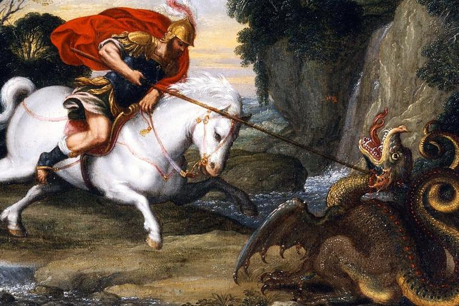

<small>*Saint George and the Dragon, Raffaello Sanzio da Urbino 1505.*</small>

# 3. Scaling Networks

*Part 3 covers the age of scaling by building a distributed tensor compiler using tinygrad IR*
